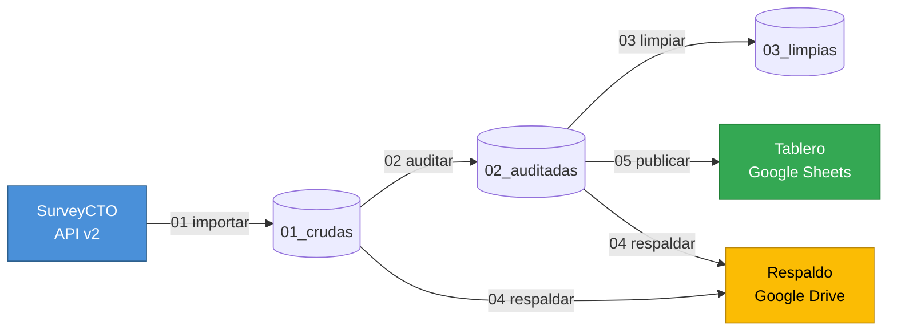

# Monitoreo de calidad en campo · encuestas CATI


Construí este pipeline para el trabajo de campo de un estudio de **percepciones
y preferencias de consumo de cerveza** en Paraguay. Cada hora baja las
entrevistas nuevas, revisa la calidad de cada una y deja el resultado en un
tablero que el equipo de campo mira en vivo.

> Versión pública y anonimizada de un proyecto real: cambié las marcas por
> `Marca A` y `Marca B`, y dejé fuera el instrumento y las credenciales.

---

## El problema que quería resolver

En una encuesta telefónica los errores se descubren tarde. El equipo levanta
casos toda la semana, alguien revisa la base el viernes, y recién ahí aparece
que un encuestador venía saltando una pregunta desde el lunes.

Para entonces ya no hay mucho que hacer: hay que rellamar, o esos casos se
pierden. Y el problema no es solo el dato perdido — es que nadie le avisó al
encuestador a tiempo.

**Así que invertí el orden.** El pipeline corre cada hora durante la jornada:
cuando un error aparece, se ve el mismo día, con el equipo todavía en línea y
el encuestado todavía contactable.

---

## El estudio

|  |  |
|---|---|
| **Objetivo** | Medir percepciones, preferencias y drivers de elección entre dos marcas |
| **Universo** | Personas de 25 a 40 años, residentes en Asunción y Gran Asunción |
| **Modalidad** | CATI — entrevista telefónica, encuestadores `CATI01`–`CATI22` |
| **Instrumento** | 27 preguntas más screening y consentimiento *(no versionado)* |
| **Screening** | `consentimiento` = 1 **y** `s1_edad` = 1 **y** `s2_residencia` = 1 |
| **Códigos** | `888` Otro · `777` No conoce la marca · `999` Sin respuesta |

El cuestionario tiene todo lo que vuelve difícil auditar este tipo de estudio:
saltos condicionales, preguntas de opción múltiple con tope de selecciones, un
top-3 de motivos ordenado, y dos baterías de atributos donde "no conozco la
marca" es una respuesta válida y no un dato faltante.

---

## Cómo funciona



Armé cada etapa como un script independiente: lee de una carpeta, escribe en
otra. Se pueden correr por separado y repetir sin romper nada.

| # | Script | Qué hace |
|---|---|---|
| **01** | `01_importar.R` | Baja el histórico completo desde la API y lo guarda en cinco formatos |
| **02** | `02_auditoria.R` | Marca las alertas de calidad y escribe el reporte para el equipo |
| **03** | `03_limpieza.R` | Deja la base lista para analizar |
| **04** | `04_monitoreo_daily.R` | Respalda crudas y auditadas en Drive |
| **05** | `05_monitoreo_hourly.R` | Publica el tablero con las etiquetas del cuestionario |

Cada base sale en `.RData` · `.xlsx` · `.csv` · `.sav` · `.dta`. Las versiones
de SPSS y Stata llevan *value labels* y *variable labels* aplicados, para
abrirlas y analizarlas sin recodificar nada. Para el `.dta` trunco las etiquetas
a 80 caracteres, que es el límite de Stata.

---

## Qué revisa la auditoría

Decidí que la auditoría **marcara, no corrigiera**. Ningún script modifica una
respuesta: solo agrega columnas 0/1 que describen qué pasa con cada caso. Qué
hacer con un registro sigue siendo decisión del equipo, y siempre se puede
volver al dato original.

`aprobada = 1` significa que el caso pasó todos los filtros.

| Columna | Qué detecta |
|---|---|
| `cumple_perfil` | Pasó el screening: consentimiento, edad y residencia |
| `m_*` | Falta una respuesta que **sí correspondía** — distingue las obligatorias de las que solo aplicaban por salto |
| `dup_telefono` `dup_correo` `dup_nombre` | Duplicados sobre campos **normalizados**: `0981 111 222` y `0981111222` son el mismo número |
| `ale_celular` | Número fuera del formato móvil paraguayo (`09` + 8 dígitos) |
| `ale_telefono_noconfirma` | El encuestador marcó que el número **no** es correcto |
| `ale_correo` | Correo faltante o mal formado |
| `ale_edad` | Edad declarada fuera del universo del estudio |
| `ale_codigo` | Código de encuestador que no existe |
| `ale_exceso_seleccion` | Marcó más opciones de las permitidas en una múltiple |
| `ale_p17_repetido` | Repitió el mismo motivo en el top-3 |
| `ale_tipo_dato` | Llegó texto en un campo que debía ser numérico |
| `ale_totales` | 1 si se activó cualquiera de las anteriores |

### El reporte que lee el equipo

La base auditada sirve para analizar, pero no para coordinar. Así que cada
corrida escribe además un `.txt` en lenguaje llano con tres bloques:

```
1) ESTADISTICAS GENERALES        cuántos entraron, cuántos califican,
                                 cuántos están aprobados

2) INCIDENCIAS POR PREGUNTA      qué se está fallando, ordenado por
                                 frecuencia

3) SEGUIMIENTO POR ENCUESTADOR   quién concentra los casos a revisar
```

El tercer bloque es el que más se usa. No dice solo *cuántos* errores hay, sino
**a quién hay que reforzar mañana** — que es la única parte accionable mientras
el campo sigue abierto.

---

## Cuándo corre

Dos workflows de GitHub Actions. Sin servidor propio y sin nadie que tenga que
acordarse de ejecutar algo.

| Workflow | Horario local | Corre |
|---|---|---|
| `hourly.yml` | Cada hora, 07:00 → 18:00 | 01 → 02 → 05 (tablero) |
| `daily.yml` | Una vez, 18:30 | 01 → 02 → 04 (respaldo) |

Los dos aceptan disparo manual desde la pestaña *Actions*.

> [!NOTE]
> El cron de GitHub se interpreta **siempre en UTC**, sin importar la variable
> `TZ` del runner. Una jornada de 07:00 a 18:00 en UTC−5 se escribe
> `0 12-23 * * *`. Es el error más común al programar estos workflows y no
> avisa: simplemente corre a la hora equivocada.

Le puse a cada workflow su propio `concurrency.group`, para que una corrida
retrasada no se pise con la siguiente.

---

## Cómo está armado

```
├── .github/workflows/
│   ├── hourly.yml           # 01 → 02 → 05
│   └── daily.yml            # 01 → 02 → 04
├── scripts/
│   ├── 00_labels.R          # etiquetas y orden de columnas
│   ├── 01_importar.R        # API → data/01_crudas
│   ├── 02_auditoria.R       # crudas → alertas → data/02_auditadas
│   ├── 03_limpieza.R        # auditadas → data/03_limpias
│   ├── 04_monitoreo_daily.R
│   └── 05_monitoreo_hourly.R
├── data/                    # estructura versionada, contenido NUNCA
└── .secrets/                # la credencial vive acá, ignorada por git
```

`data/` y `.secrets/` se ven en GitHub pero llegan **vacías**. Es a propósito:
los scripts asumen esas rutas, así que la estructura es parte del contrato del
pipeline, pero los datos de campo contienen información personal y no se
versionan nunca.

### Configuración

Todo se lee con `Sys.getenv()`, así que el mismo código corre igual en mi
máquina y en Actions. Ocho variables: cuatro para la API de SurveyCTO, dos para
las carpetas de Drive, una para el Sheet del tablero y una para la credencial.

En Actions cada una es un *secret* del repositorio. El workflow escribe el JSON
de la cuenta de servicio a disco, apunta `GDRIVE_SA` a esa ruta, y lo borra al
terminar en un paso `if: always()`.

> [!IMPORTANT]
> El acceso a Google va con una **cuenta de servicio**, no con una cuenta
> personal. Es lo que permite que todo corra sin que nadie inicie sesión.

---

## Stack

**R** (tidyverse, haven, labelled, stringi) · **GitHub Actions** ·
**SurveyCTO API v2** · **Google Drive y Sheets API**
