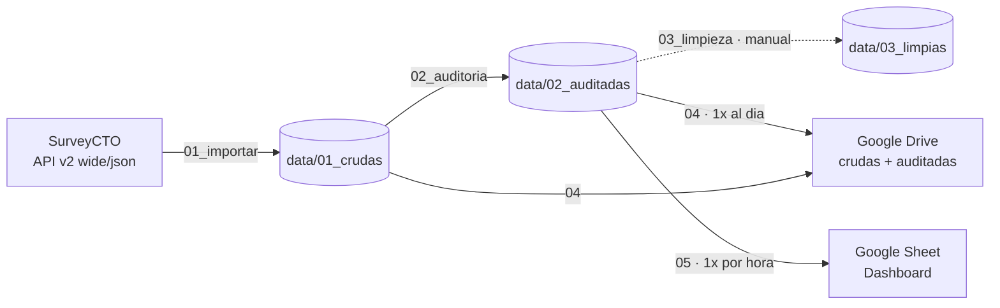

# Pipeline de monitoreo de calidad en campo

Pipeline automatizado de **monitoreo de campo** para un estudio de percepciones y
preferencias de consumo de cerveza, levantado por vía telefónica en Paraguay.

> **Versión pública y anonimizada** de un proyecto real. Se removieron el nombre
> del cliente, las marcas evaluadas (acá `Marca A` y `Marca B`), el instrumento,
> los enunciados y etiquetas del cuestionario, los enlaces y las credenciales.
> Queda la infraestructura: la lógica del pipeline, las reglas de auditoría y la
> orquestación. El repositorio es estático y los workflows no están activos.

El repositorio no contiene datos: baja las respuestas de SurveyCTO, las audita,
las publica en Google Drive y actualiza un tablero en Google Sheets — todo desde
GitHub Actions, sin intervención manual.

---

## 1. El estudio en una línea

| | |
|---|---|
| **Universo** | Personas de 25 a 40 años residentes en Asunción o Gran Asunción |
| **Modalidad** | CATI (telefónica), encuestadores `CATI01`–`CATI22` |
| **Instrumento** | 27 preguntas + screening y consentimiento *(no versionado)* |
| **Screening** | `consentimiento` = 1 **y** `s1_edad` = 1 **y** `s2_residencia` = 1 |
| **Códigos especiales** | `888` = Otro (especificar) · `777` = No conoce la marca · `999` = missing |

---

## 2. Infraestructura



Tres piezas externas:

- **SurveyCTO** — origen de los datos. Se consulta por API
  (`/api/v2/forms/data/wide/json/<formid>?date=0`), que devuelve el histórico
  completo en cada corrida.
- **GitHub Actions** — el runner. Instala R, corre los scripts y borra la
  credencial al terminar. No hay servidor propio.
- **Google Drive + Sheets** — destino. Se accede con una **cuenta de servicio**
  (no con una cuenta personal), que debe tener permiso de *Editor* en las carpetas
  y en el Sheet del tablero.

> `03_limpieza.R` (línea punteada) hoy **no está enganchado a la automatización**:
> se corre a mano. Ver [Estado conocido](#7-estado-conocido).

---

## 3. Estructura del repositorio

```
├── .github/workflows/
│   ├── hourly.yml              # 01 → 02 → 05  (dashboard)
│   └── daily.yml               # 01 → 02 → 04  (Drive)
├── scripts/
│   ├── 00_labels.R             # aplicar_labels(): value + variable labels
│   ├── 01_importar.R           # SurveyCTO API → data/01_crudas
│   ├── 02_auditoria.R          # crudas → alertas → data/02_auditadas
│   ├── 03_limpieza.R           # auditadas → data/03_limpias  (manual)
│   ├── 04_monitoreo_daily.R    # crudas + auditadas → Google Drive
│   └── 05_monitoreo_hourly.R   # auditadas + labels → Google Sheet
├── data/                       # ← estructura versionada, contenido NUNCA
│   ├── 01_crudas/
│   ├── 02_auditadas/
│   └── 03_limpias/
├── .secrets/                   # ← acá va el JSON de la cuenta de servicio (local)
├── monitoreo_surveycto_cervezas_paraguay.Rproj
└── .gitignore
```

Las carpetas `data/` y `.secrets/` se ven en GitHub pero llegan **vacías**: cada
una tiene un `.gitkeep` y el `.gitignore` bloquea todo lo demás. Es a propósito —
la estructura es parte del contrato del pipeline (los scripts asumen esas rutas),
pero los datos de campo contienen PII y no se versionan.

### Qué produce cada etapa

| Etapa | Salida | Formatos |
|---|---|---|
| `01_importar` | `data/01_crudas/cruda_campo_<fecha>` | `.RData` `.xlsx` `.csv` `.sav` `.dta` |
| `02_auditoria` | `data/02_auditadas/auditadas_campo_<fecha>` | `.RData` `.xlsx` `.csv` `.sav` `.dta` |
| `02_auditoria` | `data/02_auditadas/reporte_auditoria_campo_<fecha>.txt` | reporte legible para el equipo |
| `03_limpieza` | `data/03_limpias/limpias_campo_<fecha>` | `.RData` `.csv` |

Las versiones `.sav` y `.dta` llevan *value labels* y *variable labels* aplicados
por `00_labels.R`. Para el `.dta` las etiquetas de variable se truncan a 80
caracteres, que es el límite de Stata.

---

## 4. Automatización

| Workflow | Cron (UTC) | Hora local (UTC−5) | Corre |
|---|---|---|---|
| `hourly.yml` | `0 12-23 * * *` | 07:00 → 18:00, cada hora | 01 → 02 → 05 |
| `daily.yml` | `30 23 * * *` | 18:30 | 01 → 02 → 04 |

Ambos aceptan **`workflow_dispatch`**: se pueden disparar a mano desde la pestaña
*Actions* → *Run workflow*, sin esperar al cron.

Cada workflow tiene su propio `concurrency.group`, así que una corrida atrasada no
se pisa con la siguiente del mismo tipo.

---

## 5. Configuración

### Variables de entorno

Los scripts leen todo con `Sys.getenv()`, así que el mismo código corre en local y
en Actions sin cambios.

| Variable | Qué es | Usada por |
|---|---|---|
| `SURVEYCTO_SERVER` | subdominio del servidor SurveyCTO | 01 |
| `SURVEYCTO_USER` | usuario de la API | 01 |
| `SURVEYCTO_PASS` | contraseña de la API | 01 |
| `SURVEYCTO_FORMID` | ID del formulario | 01 |
| `DRIVE_CRUDA_URL` | carpeta de Drive para crudas | 04 |
| `DRIVE_AUDITORIA_URL` | carpeta de Drive para auditadas | 04 |
| `DASHBOARD_URL` | Google Sheet del tablero | 05 |
| `GDRIVE_SA` | credencial de la cuenta de servicio | 04, 05 |

**`GDRIVE_SA` se comporta distinto según el entorno** — es el único caso:

- **Local**: es una **ruta** al archivo, ej. `GDRIVE_SA=.secrets/gdrive_sa.json`
- **Actions**: el secret guarda el **JSON completo**; el workflow lo escribe a
  disco y redefine `GDRIVE_SA` con la ruta del runner. Se borra en un paso
  `if: always()` al terminar.

### Correr en local

1. Instalar R (≥ 4.2) y abrir `monitoreo_surveycto_cervezas_paraguay.Rproj`.
2. Crear un `.Renviron` en la raíz con las 7 primeras variables de la tabla, una
   por línea:
   ```
   SURVEYCTO_SERVER=...
   SURVEYCTO_PASS=...
   ```
3. Poner el JSON de la cuenta de servicio en `.secrets/` y agregar:
   ```
   GDRIVE_SA=.secrets/gdrive_sa.json
   ```
4. Reiniciar R (*Session → Restart R*) para que tome el `.Renviron`.
5. Correr en orden: `01_importar.R` → `02_auditoria.R` → `03_limpieza.R`.

Las dependencias se instalan solas vía `pacman::p_load()`.

### Configurar los secrets en GitHub

*Settings* → *Secrets and variables* → *Actions* → *New repository secret*, uno
por cada variable de la tabla (8 en total). El nombre del secret tiene que
coincidir exacto con el de la columna.

> **Nunca commitear credenciales.** `.Renviron`, `Renviron` y cualquier `*.json`
> están en `.gitignore`. El JSON de la cuenta de servicio va en `.secrets/`, que
> se versiona vacío.

---

## 6. Qué revisa la auditoría

`02_auditoria.R` agrega columnas de alerta a cada registro. Todas son 0/1, y
`aprobada = 1` significa que el caso pasó **todos** los filtros.

| Columna | Chequeo |
|---|---|
| `cumple_perfil` | Pasó screening: consentimiento + edad + residencia |
| `m_*` | Falta una respuesta que **sí correspondía** (obligatorias y condicionales por salto) |
| `dup_telefono` `dup_correo` `dup_nombre` | Duplicados sobre los campos normalizados (`norm_*`) |
| `ale_celular` | Celular fuera del formato móvil paraguayo (`09` + 8 dígitos) |
| `ale_telefono_noconfirma` | El encuestador marcó que el número **no** es correcto |
| `ale_correo` | Correo faltante o con formato inválido |
| `ale_edad` | Edad declarada fuera del rango 25–40 |
| `ale_codigo` | Código de encuestador fuera de `CATI01`–`CATI22` |
| `ale_exceso_seleccion` | Marcó más opciones de las permitidas en una múltiple |
| `ale_p17_repetido` | Repitió el mismo motivo en el top-3 de P17 |
| `ale_tipo_dato` | Llegó texto en un campo que debería ser numérico |
| `ale_totales` | 1 si **cualquiera** de las anteriores se activó |

El `.txt` que acompaña la base traduce todo esto a un reporte legible:
estadísticas generales, incidencias ordenadas por frecuencia y **sugerencias de
reforzamiento por encuestador** (quién concentra más casos a revisar).

---

